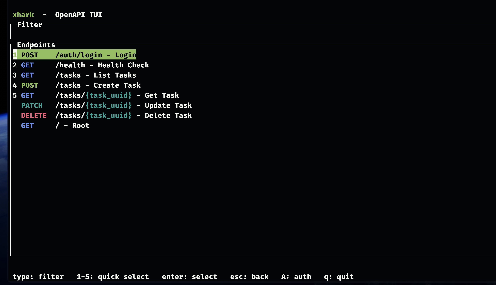
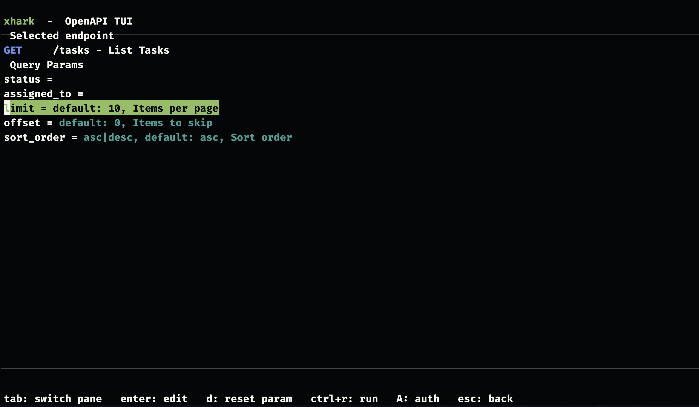
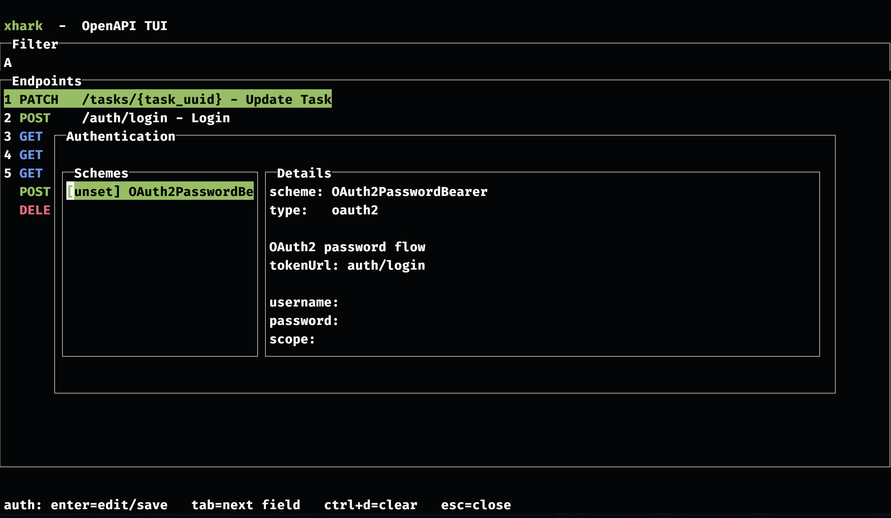
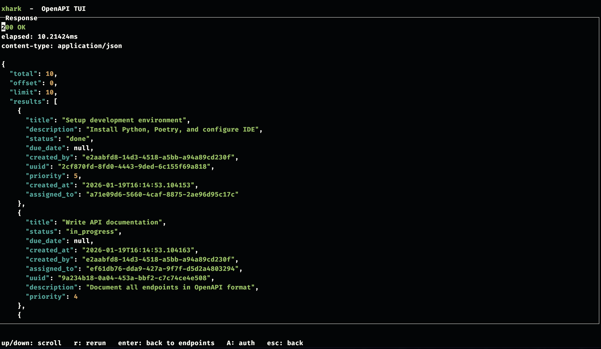

# xhark

Un cliente OpenAPI diminuto para tu terminal: navega por endpoints, construye peticiones, ejecútalas e inspecciona las respuestas en una TUI rápida.






- Navegador de endpoints impulsado por OpenAPI con filtro fuzzy
- Constructor de peticiones (parámetros de ruta + consulta)
- Edición de cuerpo JSON a través de tu `$XHARK_EDITOR` / `$EDITOR`
- Ayudante de autenticación integrado: pega un token Bearer, o obtenlo vía flujo de contraseña OAuth2 cuando esté declarado en la especificación

## Inicio rápido

Ejecutar contra una especificación local:

```bash
go run ./cmd/xhark --spec-file ./openapi.json
```

Ejecutar contra una URL (URL base inferida de la URL de la especificación):

```bash
go run ./cmd/xhark --spec-url http://localhost:8000/openapi.json
```

Si tu especificación no proporciona `servers`, pasa una URL base:

```bash
go run ./cmd/xhark --spec-file ./openapi.json --base-url http://localhost:8000
```

## Instalación

```bash
go build -o xhark ./cmd/xhark
./xhark --spec-url http://localhost:8000/openapi.json
```

## Controles

- `type`: filtrar endpoints
- `Enter`: seleccionar / confirmar (dependiendo del contexto)
- `Tab`: cambiar de panel / siguiente campo
- `Esc`: volver / cerrar modal
- `Ctrl+R`: ejecutar petición
- `A`: modal de autenticación
- `Ctrl+D`: borrar autenticación para el esquema seleccionado (dentro del modal de auth)
- `q`: salir

## Configuración

Los flags de la CLI anulan las variables de entorno.

- `XHARK_SPEC_URL`
- `XHARK_SPEC_FILE`
- `XHARK_BASE_URL`
- `XHARK_DEBUG=1` (escribe en `/tmp/xhark.log`)
- `XHARK_EDITOR` (recurre a `EDITOR`, luego a `vi`)

## Notas de Autenticación

- La obtención de tokens OAuth2 funciona para especificaciones de flujo de contraseña (`oauth2` + `flows.password.tokenUrl`, ej. `OAuth2PasswordBearer` de FastAPI).
- Si tu especificación solo declara autenticación bearer, pega un token en el modal de autenticación y xhark lo inyectará como `Authorization: Bearer <token>` para las operaciones aseguradas.
